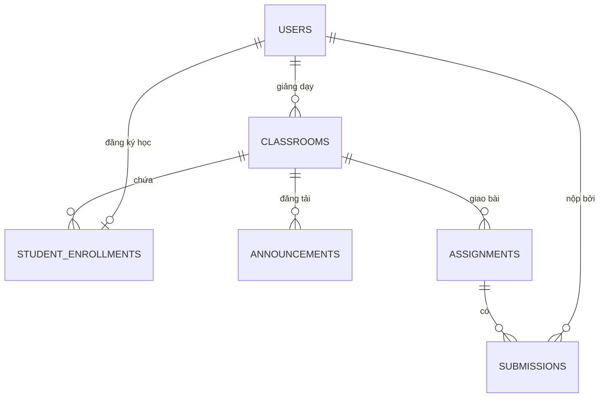
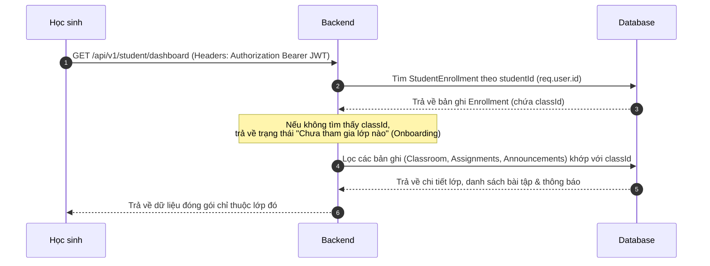
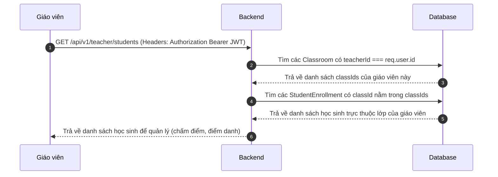

# Tài Liệu Thiết Kế Luồng Dữ Liệu & Phân Quyền Hệ Thống

Tài liệu này mô tả chi tiết kiến trúc Cơ sở dữ liệu (Database Schema), luồng đi của dữ liệu (Data Flow) và cơ chế phân quyền (Access Control) ở Backend nhằm giải quyết bài toán:
1. **Một học sinh chỉ tham gia duy nhất một lớp học** (một môn học, một thầy giáo).
2. **Giáo viên chỉ quản lý danh sách học sinh trực thuộc** các lớp học do chính mình tạo ra.
3. **Học sinh chỉ xem được bảng tin, bài tập, tài liệu và điểm số thuộc lớp học** của thầy mình giảng dạy.

---

## 1. Thiết Kế Cơ Sở Dữ Liệu (Database Schema Design)

Sử dụng cơ sở dữ liệu quan hệ hoặc MongoDB (Mongoose Schema) để thiết kế các liên kết ràng buộc chặt chẽ:



### 1.1. Bảng Người Dùng (`User`)
Lưu trữ thông tin tài khoản chung của cả Giáo viên, Học sinh và Quản trị viên.
```typescript
const UserSchema = new Schema({
  name: { type: String, required: true },
  email: { type: String, required: true, unique: true },
  password: { type: String, required: true },
  role: { type: String, enum: ['TEACHER', 'STUDENT', 'ADMIN'], required: true },
  createdAt: { type: Date, default: Date.now }
});
```

### 1.2. Bảng Lớp Học (`Classroom`)
Mỗi lớp học liên kết trực tiếp với **một giáo viên duy nhất** qua trường `teacherId`.
```typescript
const ClassroomSchema = new Schema({
  className: { type: String, required: true },
  subject: { type: String, required: true },
  classCode: { type: String, required: true, unique: true }, // Mã code 6 ký tự
  teacherId: { type: Schema.Types.ObjectId, ref: 'User', required: true }, // Giáo viên phụ trách
  createdAt: { type: Date, default: Date.now }
});
```

### 1.3. Bảng Liên Kết Học Viên (`StudentEnrollment`)
**Đây là bảng mấu chốt để ràng buộc quy tắc "Một học sinh học duy nhất một lớp/môn":**
- Trường `studentId` được thiết lập thuộc tính **`unique: true`** để đảm bảo trong toàn bộ database, một học sinh chỉ có thể có tối đa một bản ghi đăng ký lớp học (không thể tham gia lớp thứ hai).
```typescript
const StudentEnrollmentSchema = new Schema({
  studentId: { 
    type: Schema.Types.ObjectId, 
    ref: 'User', 
    required: true, 
    unique: true // BẮT BUỘC UNIQUE: Một học sinh chỉ được liên kết với duy nhất một classId
  },
  classId: { type: Schema.Types.ObjectId, ref: 'Classroom', required: true },
  studentCode: { type: String, required: true, unique: true }, // MS học sinh
  parentPhone: { type: String, required: true },
  grades: {
    mouth: [{ type: Number }],
    fifteenMin: [{ type: Number }],
    midTerm: { type: Number, default: null },
    finalTerm: { type: Number, default: null }
  },
  createdAt: { type: Date, default: Date.now }
});
```

### 1.4. Bảng Bài Tập (`Assignment`) & Bảng Tin (`Announcement`)
Liên kết chặt chẽ với lớp học (`classId`).
```typescript
const AssignmentSchema = new Schema({
  classId: { type: Schema.Types.ObjectId, ref: 'Classroom', required: true },
  title: { type: String, required: true },
  description: { type: String, required: true },
  deadline: { type: Date, required: true },
  createdAt: { type: Date, default: Date.now }
});

const AnnouncementSchema = new Schema({
  classId: { type: Schema.Types.ObjectId, ref: 'Classroom', required: true },
  title: { type: String, required: true },
  content: { type: String, required: true },
  authorId: { type: Schema.Types.ObjectId, ref: 'User', required: true },
  createdAt: { type: Date, default: Date.now }
});
```

---

## 2. Luồng Dữ Liệu Ở Phía Học Sinh (Student Data Flow)

Học sinh sau khi đăng nhập thành công sẽ nhận được JWT Token đại diện cho `studentId`.



### Quy tắc bảo mật ở Backend:
- Không bao giờ cho phép Học sinh truyền trực tiếp tham số `classId` từ Client lên để lấy dữ liệu.
- `classId` **luôn luôn được trích xuất ở Backend** thông qua bảng liên kết `StudentEnrollment` bằng ID người dùng trong Token:
```typescript
// Ví dụ mã nguồn Controller lấy thông tin Dashboard của Học sinh
export const getStudentDashboard = async (req: Request, res: Response) => {
  const studentId = req.user.id; // Lấy từ JWT token đã xác thực

  // 1. Tìm lớp học duy nhất học sinh đã tham gia
  const enrollment = await StudentEnrollment.findOne({ studentId }).populate('classId');
  if (!enrollment) {
    return res.status(200).json({ hasClass: false, message: "Học sinh chưa tham gia lớp học nào." });
  }

  const classId = enrollment.classId._id;

  // 2. Lấy dữ liệu giới hạn theo lớp học này
  const announcements = await Announcement.find({ classId }).sort({ createdAt: -1 });
  const assignments = await Assignment.find({ classId });
  
  // 3. Lấy điểm danh & nộp bài của riêng học sinh trong lớp này
  const attendance = await Attendance.find({ classId, "records.studentId": studentId });
  const submissions = await Submission.find({ studentId });

  res.status(200).json({
    hasClass: true,
    classroom: enrollment.classId,
    announcements,
    assignments,
    attendance,
    submissions,
    grades: enrollment.grades
  });
};
```

---

## 3. Luồng Dữ Liệu Ở Phía Giáo Viên (Teacher Data Flow)

Giáo viên đăng nhập, nhận JWT Token đại diện cho `teacherId`.



### Quy tắc bảo mật ở Backend:
- Khi Giáo viên thực hiện thao tác **chấm điểm**, **điểm danh**, hay **đăng thông báo**, Backend phải kiểm tra xem Giáo viên đó có thực sự là chủ sở hữu của lớp học (`classId`) đó không:
```typescript
// Middleware kiểm tra quyền sở hữu lớp học của Giáo viên
export const verifyClassOwnership = async (req: Request, res: Response, next: NextFunction) => {
  const teacherId = req.user.id;
  const classId = req.body.classId || req.query.classId;

  const classroom = await Classroom.findOne({ _id: classId, teacherId });
  if (!classroom) {
    return res.status(403).json({ error: "Bạn không có quyền thực hiện thao tác trên lớp học này!" });
  }
  next();
};
```

---

## 4. Chi Tiết Danh Sách API Router Đề Xuất

### 4.1. Nhóm API cho Học sinh
- `POST /api/v1/student/join-class` : Học sinh tham gia lớp bằng mã code.
  - *Luồng xử lý*: Kiểm tra xem học sinh đã tồn tại trong `StudentEnrollment` chưa. Nếu rồi thì chặn (vì chỉ học 1 lớp). Nếu chưa, tìm lớp khớp với `classCode` và tạo bản ghi liên kết mới.
- `GET /api/v1/student/dashboard` : Lấy thông tin lớp học, thông báo, bài tập của lớp duy nhất học sinh đó đang học.
- `POST /api/v1/student/submit-assignment` : Nộp bài tập. Backend tự động gán `studentId` từ JWT Token của học sinh.

### 4.2. Nhóm API cho Giáo viên
- `GET /api/v1/teacher/classrooms` : Lấy danh sách lớp học do giáo viên đó tạo.
- `POST /api/v1/teacher/create-class` : Giáo viên tạo lớp mới (sinh mã code tự động).
- `GET /api/v1/teacher/classrooms/:classId/students` : Xem danh sách học sinh thuộc lớp của mình. (Có áp dụng `verifyClassOwnership`).
- `PUT /api/v1/teacher/grade` : Chấm điểm bài nộp học sinh.
- `POST /api/v1/teacher/attendance` : Ghi nhận điểm danh cho học sinh trong lớp.
